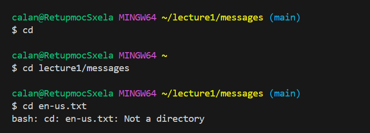
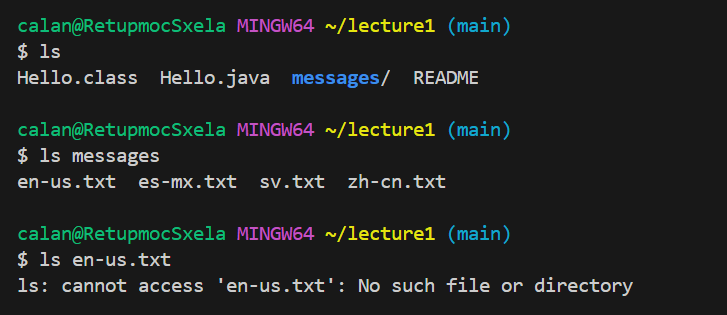
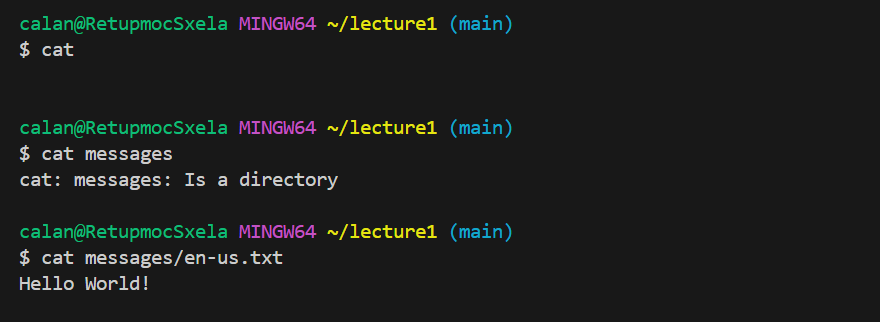

# Lab Report Blog

`cd`: The absolute directory for `cd` is /c/Users/calan/lecture1. I got the output of going back to the parent directory because when you run `cd` by itself in the terminal, it takes 
      you back to the parent directory. This is not an error.
`cd lecture1/messages`: The absolute directory for `cd lecture1/messages` is /c/Users/calan. I got the output of changing my directory to messages. This is not an error. 
`cd en-us.txt`: The absolute directory for `cd en-us.txt` is /c/Users/calan/lecture1/messages. I got the output "Not a directory". This is an error because `cd` is finding a directory
                while en-us.txt is a file, which results in an error.

`ls`: The absolute directory for `ls` is /c/Users/calan/lecture1. I got the output .
      This is not an error, as it shows the list from the directory of lecture1.
`ls messages`: The absolute directory for `ls messages` is /c/Users/calan/lecture1. I got the output .
               This is not an error, as it shows the list that is within the directory of messages.
`ls en-us.txt`: The absolute directory for `ls en-un.txt` is /c/Users/calan/lecture1/messages. I got the output .
                This is an error, as there is not list within en-un.txt. This results in an error.

`cat`: The absolute directory for `cat` is /c/Users/calan/lecture1. I got no output, as it resulted in a continuous loop, which resulted in no output.
       . This is an error.
`cat messages`: The absolute directory for `cat messages` is /c/Users/calan/lecture1. It resulted in the output .
                This is an error, as you cannot concatenate a directory.
`cat messages/en-us.txt`: The absolute directory for `cat messages/en-us.txt` is /c/Users/calan/lecture1. It resulted in the output .
                          This is not an error, as it concatenated the text within the file of en-us.txt.

